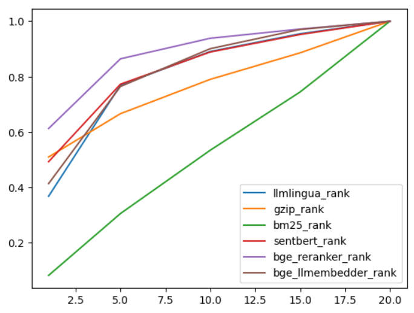

<center>

# 自然语言处理结题报告

### 实验题目: 基于 LangChain实现的大模型检索增强

#### 小组成员: 汪奕航、赵越、张子琛

#### 学号: 2021213652、2021213646、2021213671

#### 贡献度: 00000000000000000000000000000000

</center>

## 任务说明
这里是任务说明和概况
### 实验数据

### 实验环境

## 基础任务
这里说基础RAG的部分

## 自选拓展任务

### 检索策略优化
为了尝试更多检索算法和重排算法，以便于确定一个较好的检索流程，我们尝试多个检索重排算法，并在长文本数据集NQ上进行测试，NQ数据集的构成是若干个含有一个query和20个context的样本，每个样本中有一个最匹配的context，以便我们来测试Recall@n(n=1, 5, 10, 15, 20)的质量

#### 数据集

NQ数据集，全称为Natural Questions数据集，是由Google发布的一种大型问答数据集。它被设计用于训练和评估机器学习模型在自然语言理解和生成方面的能力。

数据集中的问题和答案来自真实的用户查询，这些查询是通过Google搜索输入的。答案来源于Wikipedia，确保了高质量和权威性。每个样本由以下部分构成：问题，数据集中的每个问题都是用户自然提出的，具有多样性和复杂性；答案，每个问题对应的答案在Wikipedia页面中标注，答案的标注分为长答案和短答案，分别对应段落级和句子级的精确定位；文档片段，每个问题对应的文档片段是从相关的Wikipedia页面中抽取的，这些文档片段提供了上下文信息，帮助模型理解问题并找到正确答案。

#### 检索算法介绍

##### 1. bge_reranker_rank
**BGE Reranker**是一种基于大规模语言模型（LLM）的重新排序算法。它使用上下文信息和复杂的嵌入技术对初步排序结果进行重新评估，从而提高排序的精确度和相关性。这种方法通常在检索任务中表现出色，特别是在精确匹配和语义理解方面。

##### 2. bge_llmembedder_rank
**BGE LLM Embedder**是另一种基于大规模语言模型的排序算法。它主要通过生成高质量的嵌入向量来表示查询和文档的语义信息，然后计算它们之间的相似度进行排序。这种方法通常在处理自然语言理解任务时效果显著。

##### 3. sentbert_rank
**Sentence-BERT (SentBERT)**是一种基于BERT的句子嵌入模型。它通过调整BERT模型使其能够生成高质量的句子嵌入，用于计算句子或短文档之间的相似度。SentBERT在许多自然语言处理任务中表现优异，尤其是在语义搜索和句子相似度计算方面。

##### 4. gzip_rank
**Gzip Rank**是一种基于数据压缩的排序方法。它利用gzip压缩算法的特点，通过压缩查询和文档计算压缩率的变化来衡量它们的相似度。尽管这种方法比较简单，但在某些特定场景下仍然能够取得不错的效果。

##### 5. llmlingua_rank
**LlmLingua**是一种基于自信息（self-information）作为每个token重要程度的排序算法。它通过计算每个token的重要性，删除不重要的token，然后将重要文段排在前面。此方法在提取关键内容和提高排序结果的相关性方面有显著优势。

##### 6. bm25_rank
**BM25**是传统的信息检索算法，基于词频（TF）和逆文档频率（IDF）。它通过计算查询词和文档词的匹配程度来排序结果。BM25是一种基准算法，尽管相对简单，但在许多信息检索任务中仍然表现良好。

### 微调BGE的检索模型

为了进一步提升模型的生成能力，即pred与给定答案的相关度，我们尝试提升模型的检索文段能力，通过微调Embdding模型提升检索能力和正确答案的召回率。我们使用了标注后的CRAG数据集微调bge-small-en-v1.5模型。在具体微调过程中，我们使用了FlagEmbedding的微调方法

#### 数据集

微调时需要构造query对应的chunk正负样例，因此需要重构CRAG数据集，对于每个query人工标注出正例pos和负例neg，其中正例包含与答案相关度更大的文段，即答案在文章中的出处，负例包含其余的相关度更小的无关文段，通过人工标注的数据将人类检索答案偏好和方法交给模型学习。这里我们采用了黄成梓同学在github上共享的数据集`BGE.jsonl`，重构自`crag_data_2735.jsonl`数据集，每个query包含一个pos项和若干neg项。

另外，我们需要将数据集预先划分为训练集和测试集，以防止模型预先学习到测试集内的数据而导致评估过程失去评估泛化能力的意义。然后我们调整了测试集的格式，使格式与框架中给定的评估corpus和query格式相同，通过将neg和pos样例组成content作为corpus：

```python
def process_data(data):
    """Processes the data to create two separate lists for content and query."""
    content_list = []
    query_list = []

    for entry in data:
        query = entry["query"]
        pos = entry["pos"]
        neg = entry["neg"]

        # Create content entries
        for item in [query] + pos + neg:
            content_entry = {
                "content": item
            }
            content_list.append(content_entry)

        # Create query entry
        query_entry = {
            "query": query,
            "positive": pos
        }
        query_list.append(query_entry)

    return content_list, query_list
```

#### 微调过程

我们阅读了FlagEmbedding的微调代码，主要步骤分为数据加载、模型定义、训练与打分评估：

#### 数据加载

从jsonl文件中提取每条query，pos和neg，每个正例随机取一条，负例随机取n-1条，n默认为8。将pos和neg合并为passage，完成dataset的加载：

```python
    def __getitem__(self, item) -> Tuple[str, List[str]]:
        query = self.dataset[item]['query']
        if self.args.query_instruction_for_retrieval is not None:
            query = self.args.query_instruction_for_retrieval + query

        passages = []

        assert isinstance(self.dataset[item]['pos'], list)
        pos = random.choice(self.dataset[item]['pos'])
        passages.append(pos)

        if len(self.dataset[item]['neg']) < self.args.train_group_size - 1:
            num = math.ceil((self.args.train_group_size - 1) / len(self.dataset[item]['neg']))
            negs = random.sample(self.dataset[item]['neg'] * num, self.args.train_group_size - 1)
        else:
            negs = random.sample(self.dataset[item]['neg'], self.args.train_group_size - 1)
        passages.extend(negs)

        if self.args.passage_instruction_for_retrieval is not None:
            passages = [self.args.passage_instruction_for_retrieval+p for p in passages]
        return query, passages
```

#### 模型定义

模型使用了预训练bert连接池化层作为encoder，前向中query和passage经过encoder计算相似度得分，然后根据target和score算交叉熵损失loss：

```python
    def forward(self, query: Dict[str, Tensor] = None, passage: Dict[str, Tensor] = None, teacher_score: Tensor = None):
        q_reps = self.encode(query)
        p_reps = self.encode(passage)

        if self.training:
            if self.negatives_cross_device and self.use_inbatch_neg:
                q_reps = self._dist_gather_tensor(q_reps)
                p_reps = self._dist_gather_tensor(p_reps)

            group_size = p_reps.size(0) // q_reps.size(0)
            if self.use_inbatch_neg:
                scores = self.compute_similarity(q_reps, p_reps) / self.temperature # B B*G
                scores = scores.view(q_reps.size(0), -1)

                target = torch.arange(scores.size(0), device=scores.device, dtype=torch.long)
                target = target * group_size
                loss = self.compute_loss(scores, target)
            else:
                scores = self.compute_similarity(q_reps[:, None, :,], p_reps.view(q_reps.size(0), group_size, -1)).squeeze(1) / self.temperature # B G

                scores = scores.view(q_reps.size(0), -1)
                target = torch.zeros(scores.size(0), device=scores.device, dtype=torch.long)
                loss = self.compute_loss(scores, target)

        else:
            scores = self.compute_similarity(q_reps, p_reps)
            loss = None
        return EncoderOutput(
            loss=loss,
            scores=scores,
            q_reps=q_reps,
            p_reps=p_reps,
        )
```

#### 训练

训练部分句子实现了嵌入模型的保存，使用`sentence-transformers`库保存模型检查点，支持不同的池化模式（如cls）和可选的归一化层。并通过扩展`Trainer`类，实现自定义的模型保存逻辑和损失计算逻辑，实现了自定义训练过程。

```python
class BiTrainer(Trainer):
    def _save(self, output_dir: Optional[str] = None, state_dict=None):
        output_dir = output_dir if output_dir is not None else self.args.output_dir
        os.makedirs(output_dir, exist_ok=True)
        logger.info("Saving model checkpoint to %s", output_dir)
        # Save a trained model and configuration using `save_pretrained()`.
        # They can then be reloaded using `from_pretrained()`
        if not hasattr(self.model, 'save'):
            raise NotImplementedError(
                f'MODEL {self.model.__class__.__name__} '
                f'does not support save interface')
        else:
            self.model.save(output_dir)
        if self.tokenizer is not None and self.is_world_process_zero():
            self.tokenizer.save_pretrained(output_dir)

        torch.save(self.args, os.path.join(output_dir, "training_args.bin"))

        # save the checkpoint for sentence-transformers library
        if self.is_world_process_zero():
            save_ckpt_for_sentence_transformers(output_dir,
                                                pooling_mode=self.args.sentence_pooling_method,
                                                normlized=self.args.normlized)

    def compute_loss(self, model, inputs, return_outputs=False):
        """
        How the loss is computed by Trainer. By default, all models return the loss in the first element.

        Subclass and override for custom behavior.
        """

        outputs = model(**inputs)
        loss = outputs.loss

        return (loss, outputs) if return_outputs else loss
```

利用上述步骤中给出的代码和文件结构，我们可以快速完成微调bge嵌入模型的工作，只需要设置好对应参数并划分训练数据集即可。这里有一些关键的参数需要修改，如`nproc_per_node`指GPU数量，`num_train_epochs`控制训练轮次，`per_device_train_batch_size`控制训练批次大小等：

```shell
torchrun --nproc_per_node 1 \
-m FlagEmbedding.baai_general_embedding.finetune.run \
--output_dir bge-small-en-v1.5-finetune \
--model_name_or_path BAAI/bge-small-en-v1.5 \
--train_data bge/train_data.jsonl \
--learning_rate 1e-5 \
--fp16 \
--num_train_epochs 150 \
--per_device_train_batch_size 4 \
--gradient_accumulation_steps 32 \
--dataloader_drop_last True \
--normlized True \
--temperature 0.02 \
--query_max_len 256 \
--passage_max_len 512 \
--train_group_size 6 \
--logging_steps 10 \
--logging_strategy steps \
--query_instruction_for_retrieval "" \
--report_to tensorboard \
--save_steps 500 \
--save_strategy steps \
--save_total_limit 10 
```

#### 评估

这部分代码中分别对模型预测结果的多项评估指标进行计算，并且分别计算了1、10、100四个截断值下四种指标的分数，用于评估模型在不同长度的结果列表中的表现。

- **Mean Reciprocal Rank (MRR)**
    MRR 衡量查询结果排序质量的指标。具体来说，它计算每个查询结果中第一个相关结果的倒数位置的平均值。公式如下：

    \[ \text{MRR} = \frac{1}{|Q|} \sum_{i=1}^{|Q|} \frac{1}{\text{rank}_i} \]

    其中，\(\text{rank}_i\) 是第 \(i\) 个查询的第一个相关结果的排名。

- **Recall**
    Recall 衡量检索系统中找回的相关结果与所有相关结果的比率。公式如下：

    \[ \text{Recall} = \frac{|\text{relevant documents retrieved}|}{|\text{relevant documents}|} \]

- **Area Under Curve (AUC)**
    AUC 是ROC（Receiver Operating Characteristic）曲线下面积的缩写，用于评估二分类模型的性能。ROC曲线展示了分类器在各种阈值下的表现，AUC值越接近1表示模型性能越好。

- **Normalized Discounted Cumulative Gain (nDCG)**
    nDCG 适用于多级相关性评估，通过计算实际排序与理想排序之间的差异来衡量排序质量。公式如下：

    \[ \text{nDCG} = \frac{DCG}{IDCG} \]

    其中，DCG（Discounted Cumulative Gain）和IDCG（Ideal Discounted Cumulative Gain）分别表示实际排序和理想排序的折扣累积增益。

将test_corpus和test_query放置在对应目录下，然后直接运行下面的脚本对微调模型进行评估：

```shell
python -m FlagEmbedding.baai_general_embedding.finetune.eval_msmarco \
--encoder BAAI/bge-small-en-v1.5 \
--fp16 \
--add_instruction \
--k 100 \
--corpus_data bge/test_corpus.json \
--query_data bge/test_query.json
```

### 对LLM进行进一步微调

根据自己的算力情况，使用给定的CRAG数据对LLM做进一步的预训练或有监督微调

对使用的LLM框架不做限制，可参考llama-factory,megatron-lm框架，以及阿里进行二次封装之后的Pai-Megatron-Patch框架

## 实验结果与分析

### 基础任务

基础rag效果展示

### 检索方法优化



这张图比较了多种排序算法的性能。横坐标表示recall@n中的n，纵坐标表示相应的召回率。

1. **bge_reranker_rank（紫色线）**：
   - 在所有的n值上，该算法的召回率表现最好。
   - 其召回率迅速达到较高值，表明它在前n个结果中能够有效地找到相关项。

2. **bge_llmembedder_rank（棕色线）**：
   - 该算法的召回率非常接近bge_reranker_rank。
   - 表现出类似的趋势，说明它也能够在前n个结果中高效地找到相关项。

3. **sentbert_rank（红色线）**：
   - 该模型的召回率也非常好，接近bge模型。
   - 随着n值的增加，召回率稳步提升，表明其性能相当稳定。

4. **gzip_rank（橙色线）**：
   - 在较小的n值上，gzip_rank的召回率低于前面几种模型，但随着n值增加，其召回率逐渐接近较高水平。
   - 这种趋势表明该模型在处理更多结果时表现较好。

5. **llmlingua_rank（蓝色线）**：
   - 在初始阶段，该模型的召回率还可以，但提升速度相对较慢。
   - 随着n值增加，召回率稳定提升，但未能赶上前面几种模型。

6. **bm25_rank（绿色线）**：
   - 作为传统的信息检索算法，bm25的召回率在所有n值上都明显低于其他模型。
   - 它的召回率呈线性提升，速度较慢。

总结
- **最佳表现**：bge_reranker_rank和bge_llmembedder_rank在所有n值上均表现出色，显示了其在召回率方面的优势。
- **中等表现**：sentbert_rank表现也非常好，紧随其后。
- **一般表现**：gzip_rank在较大n值时表现不错，但起步稍慢。
- **较差表现**：llmlingua_rank在所有n值上的召回率提升较慢，而bm25_rank在所有n值上的表现最差。

这些结果表明，现代机器学习模型（如bge和sentbert）在召回率上显著优于传统方法（如bm25），尤其是在较小n值时表现突出。bge模型（包括reranker和llmembedder）的嵌入和排序技术特别有效。

### 微调BGE检索

微调bge-small-en-v1.5的Loss随训练轮次变化如下，训练至150轮次以及达到收敛，整体曲线平滑起伏小。


微调150轮次总共2515个steps，我们每隔500步保存模型并用四个指标对模型的检索能力进行评估，得到的结论是微调后的模型检索能力较微调前产生了显著的提升，但是随训练轮次提升而只有较小的提升。我们猜想原因可能是原嵌入模型的参数规模较小，也有一个潜在的原因是这几个指标还不能将模型检索的能力完全量化，即仍存在更适用的评测指标。
好的，我们将这些数据填入到表格中，精确到小数点后四位。
|                                     | MRR@10   | MRR@100  | Recall@10 | Recall@100 | AUC@100  | nDCG@10  | nDCG@100 |
| ----------------------------------- | -------- | -------- | --------- | ---------- | -------- | -------- | -------- |
| bge-small-en-v1.5                   | 0.1053   | 0.1128   | 0.3053    | 0.4954     | 0.7528   | 0.1624   | 0.2067   |
| bge-small-en-v1.5-finetune-checkpoint500  | 0.1387   | **0.1483**   | 0.3803    | **0.6399**     | 0.7495   | 0.2062   | **0.2695**   |
| bge-small-en-v1.5-finetune-checkpoint1000 | 0.1391   | 0.1481   | 0.3803    | 0.6325     | 0.7905   | 0.2069   | 0.2671   |
| bge-small-en-v1.5-finetune-checkpoint1500 | 0.1387   | 0.1481   | 0.3766    | 0.6307     | 0.8005   | 0.2058   | 0.2668   |
| bge-small-en-v1.5-finetune-checkpoint2000 | **0.1392**   | 0.1482   | **0.3821**    | 0.6271     | **0.8094**   | **0.2070**   | 0.2664   |
| bge-small-en-v1.5-finetune-checkpoint2500 | 0.1387   | 0.1475   | 0.3803    | 0.6289     | 0.8092   | 0.2061   | 0.2657   |


### 微调LLM

微调baichuan2-7b的结果的Loss随训练轮次变化如下。

微调结束后，我们将CRAG测试集中随机抽样240条作为评测集，固定其输入结果，即将人工标注的检索结果作为输入prompt的一部分，得到的结论是微调后的模型生成能力较微调前产生了显著的提升，甚至超过了baichuan2系列最好的模型baichuan2-turbo，结果如下
|                    | BLEU     | ROUGE-L  | BERTScore |
| -------------------| -------- | -------- | --------- |
| baichuan2-turbo    | 0.0757   | 0.1721   | 0.4329    |
| baichuan2-7b       | 0.0672   | 0.1529   | 0.4216    |
|**baichuan2-7b-sft**|**0.4388**|**0.2398**|**0.5564** |

## 系统演示说明

## 总结与反思