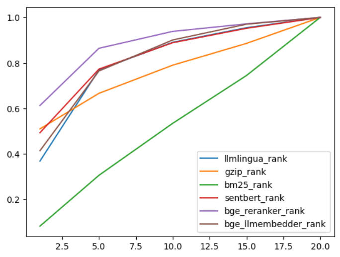
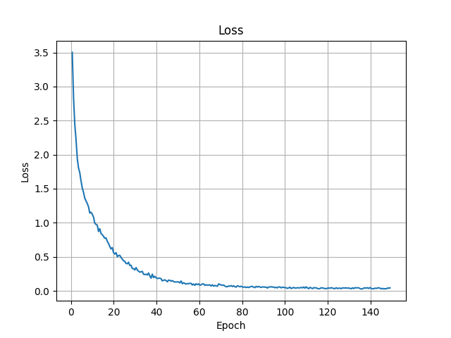
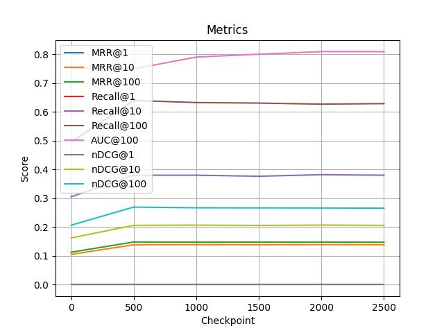
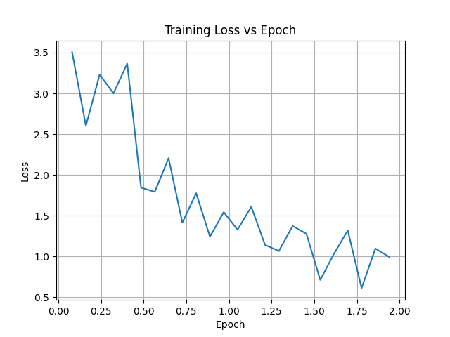
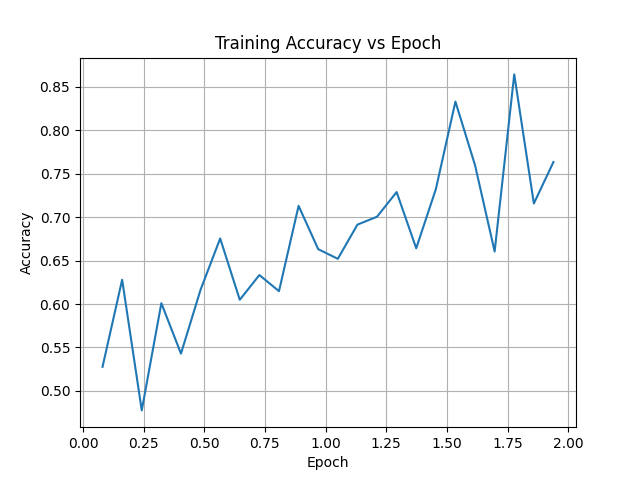
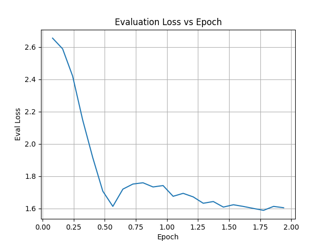
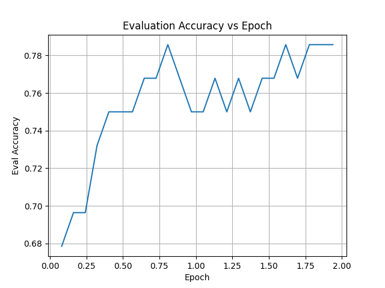

<center>

# 自然语言处理结题报告

### 实验题目: 基于 LangChain实现的大模型检索增强

#### 小组成员: 汪奕航、赵越、张子琛

#### 学号: 2021213652、2021213646、2021213671

#### 贡献度: 00000000000000000000000000000000

</center>

## 任务说明

近年来，大语言模型在问答领域展现了极强的能力，例如GPT[^4]，但仍存在幻觉、知识过时、可解释性弱、注入知识成本过高等问题。检索增强生成技术[^2]通过整合来自外部数据库的知识，成为一种可行的解决方案。这增强了模型的准确性和可信度，特别是对于知识密集型任务，而且允许持续的知识更新和特定领域的信息采集。

由Lewis在2020年中引入的RAG（Retrieval-Augmented Generation）是LLM领域的一个范例，显著增强了生成任务。具体来说，RAG涉及一个初始检索步骤，模型在此步骤中查询外部数据源以获取相关信息，然后再继续回答问题或生成文本。这个过程不仅为后续的生成阶段提供了信息，而且确保了响应基于检索到的证据，从而显著提高了输出的准确性和相关性。在推理阶段从知识库中动态检索信息使RAG能够解决诸如生成事实不正确的内容(通常称为“幻觉”[^15])之类的问题。将RAG集成到LLM中已经得到了迅速的采用，并已成为改进聊天机器人功能和使LLM更适合实际应用的关键技术。

我们小组使用langchain框架为主体，实现了基于向量检索的大模型检索增强生成任务[^1]，可以自动在知识库中找到与用户问题相关的片段，辅助大模型生成答案。知识库方面，主要采用了CRAG_200,CRAG_2735数据集和我们自己搜集到的NQ数据集[^9]；微调数据集方面，我们采用了CRAG_2735数据集，对数据集进行负样本挖掘和格式重构；指标方面，除了老师推荐的BLEU[^11]和Rouge-L[^12]，我们还将实现Bert-score[^10]，另外在BGE嵌入模型微调中，我们引入了MRR和nDCG指标，更全面地观察模型微调效果。

检索方面，我们使用BGE系列[^7]检索模型和重排模型，BM25算法[^8]，以及最新提出的LLMlingua算法[^3]；生成模型方面，我们将使用闭源模型Baichuan[^5]，Deepseek[^6]，ChatGPT[^4]等模型，以及开源模型Baichuan2，Qwen[^13]，GLM3[^14]等模型。通过实现不同的RAG策略和评测标准，我们旨在探索和评估各种方法在检索增强生成领域的有效性和实用性。最后，我们通过大语言模型微调、BGE检索模型微调、以及检索策略优化、找回后处理等方式提升系统的性能。

由于我们小组选择使用Langchain框架从零开始完成整个RAG系统的实现和部署，我们的结题报告内容展开方式将以**RAG系统框架**和**作业指定自选题目**两部分内容为核心，另外报告内容还包括实验数据、实验环境和实验结果展示部分。

### 实验数据

#### CRAG数据集

CRAG数据集，全称为KDD CUP 2024 CRAG:Comprehensive Rag Benchmark数据集，包含反映真实场景的问答对，共2735条。它涵盖五个领域：金融、体育、音乐、电影和百科开放领域。这些领域代表了信息变化速率的不同：快速（金融和体育）、渐进（音乐和电影）和稳定（开放领域）。

CRAG 包含八种类型的英文问题：

- 简单问题：询问简单事实的问题，如某人的出生日期和一本书的作者。
- 带有条件的简单问题：询问带有某些条件的简单事实的问题，如某个日期的股票价格和某导演在某一类型中的最新电影。
- 集合问题：期望一组实体或对象作为答案的问题。例如，南半球有哪些大陆？
- 比较问题：可能比较两个实体的问题，如谁开始表演得更早，Adele 还是 Ed Sheeran？
- 聚合问题：可能需要聚合检索结果才能回答的问题，例如，Meryl Streep 获得了多少奥斯卡奖？
- 多跳问题：可能需要链式多条信息来组成答案的问题，如谁出演了李安的最新电影？
- 后处理问题：需要推理或处理检索信息才能获得答案的问题，例如，Thurgood Marshall 担任最高法院法官多少天？
- 假设前提问题：有错误前提或假设的问题，例如，Taylor Swift 在转向流行音乐之前发布的说唱专辑名称是什么？（Taylor Swift 并未发布过任何说唱专辑。）

每条数据包含query、answer、和search_results，包括可能和query相关的五个网页内容，对应每个网页内分别包含page_name,page_url, page_snippet和page_result的内容，一共2735条。这里我们采用了清理后的全量数据集作为微调数据集.

#### NQ数据集

NQ数据集，全称为Natural Questions数据集，是由Google发布的一种大型问答数据集。它被设计用于训练和评估机器学习模型在自然语言理解和生成方面的能力。

数据集中的问题和答案来自真实的用户查询，这些查询是通过Google搜索输入的。答案来源于Wikipedia，确保了高质量和权威性。每个样本由以下部分构成：问题，数据集中的每个问题都是用户自然提出的，具有多样性和复杂性；答案，每个问题对应的答案在Wikipedia页面中标注，答案的标注分为长答案和短答案，分别对应段落级和句子级的精确定位；文档片段，每个问题对应的文档片段是从相关的Wikipedia页面中抽取的，这些文档片段提供了上下文信息，帮助模型理解问题并找到正确答案。

### 实验环境

#### 硬件环境

| 实验 | 硬件环境           |
|------|--------------------|
| 基础RAG的实现和部署 | 本地机器|
| 实验1：检索优化 |  A800  (80G)      |
| 实验2：微调BGE | RTX3090 (24G) x1  |
| 实验3：微调LLM | RTX4090 (24G) x2  |

#### 软件环境

Ubuntu 22.04
python 3.10
Pytorch 2.3.0
Cuda 12.1

```shell
conda create -n rag python=3.10
conda init
conda activate rag

conda install pytorch==2.3.0 torchvision==0.18.0 torchaudio==2.3.0 pytorch-cuda=12.1 -c pytorch -c nvidia


```

## RAG系统框架

### 数据处理与索引构建 (Your Data -> Index)

这一部分的流程包括系统将用户信息解析为字符串，对其进行切片和向量化处理，并最终存储到向量数据库中。这一过程的实现包括以下四个主要组件：

#### 数据加载器 (dataloader)

我们利用LangChain封装的文本解析器处理各种文件格式，包括txt、docx和pdf等。尽管LangChain在处理pdf文件时可能存在一些不足，但在处理其他格式时表现良好。这个解析器允许我们从这些文件中提取文本信息，以便后续分析和处理。

```python
def load_docs(path):
    if path.endswith('.txt'):
        loader = TextLoader(path)
    elif path.endswith('.pdf'):
        loader = PyPDFLoader(path)
    elif path.endswith('.docx') or path.endswith('.doc'):
        loader = Docx2txtLoader(path)
    return loader.load()
```

#### 切片器 (splitter)

切片方法上，我们采用了LangChain实现的递归型切片器，将长文档拆分为更小的文本片段。这样可以提高向量化处理的效率和精度，有助于更精准的文档检索和匹配，从功能上具体分为两种：

- **自动分割策略**：根据预定义的分隔符和分块大小，自动将文档分割为更小的片段。
- **用户定义分割策略**：允许用户自定义分隔符、分块大小和重叠部分，以满足特定需求。

创建知识库和添加知识库的方法类似，以知识库的创建方法函数`create_knowledge`为例，先读取指定目录中的所有文档，并根据文件格式加载文档内容，然后使用递归分割器将文档分割为多个小块，并统计每个文档块的来源，为每个文档块添加总数元数据：

```python
    if split_strategy.get('mode') == 'auto':
        splitter = RecursiveCharacterTextSplitter(
            separators=['.', '!', '。', '!', '\n'],
            keep_separator=False,
            chunk_size=1024,
            chunk_overlap=256,
            length_function=len,
        )
    elif split_strategy.get('mode') == 'user-defined':
        splitter = RecursiveCharacterTextSplitter(
            separators=split_strategy.get('separators'),
            keep_separator=False,
            chunk_size=split_strategy.get('chunk_size'),
            chunk_overlap=split_strategy.get('chunk_overlap'),
            length_function=len,
        )
    else:
        return {'code': 0, 'message': '处理失败'}
    document_split = []
    dir_path = dir_path + '/{}'.format(kg_name)
    for path in tqdm(os.listdir(dir_path)):
        document = load_docs(dir_path+'/'+path)
        document_split += splitter.split_documents(document)
    sta = {}
    for doc in document_split:
        if doc.metadata['source'] in sta:
            sta[doc.metadata['source']] += 1
        else:
            sta[doc.metadata['source']] = 1
    for doc in document_split:
        doc.metadata['total'] = sta[doc.metadata['source']]
```

#### 向量存储 (vectorstore)

FAISS（Facebook AI Similarity Search）是一种高效的相似性搜索库，能够在大规模向量数据中进行快速检索。我们使用LangChain封装的函数实现了FAISS向量存储库，在创建和添加知识库中利用向量存储知识库的内容。

`create_knowledge`函数在递归分割后，使用 FAISS 库将分割后的文档块嵌入到向量空间中，并将索引保存到本地：

```python
    faiss_index = FAISS.from_documents(document_split, embeddings)
    faiss_index.save_local('knowledge_base/vector_db/{}_index'.format(kg_name))
    return {'code': 1, 'message': '处理成功'}
```

#### 嵌入模型 (embedding)

嵌入模型的选择上，我们尝试了HuggingFace上开源的嵌入模型bge-m3和bge-small-en-v1.5，用于将文本转换为向量。bge-m3是一种性能优异的嵌入模型，能够捕捉文本中的语义信息，有助于提高检索精度，并且相较bge-small-en-v1.5，前者参数量更大，对于下游任务表现更好，后续我们在拓展任务中微调了bge-small-en-v1.5以尝试提升其检索能力。

```python
embedding_model = model_config.embedding_model
embeddings = HuggingFaceEmbeddings(model_name=r'./models/{embedding_model}'.format(embedding_model=embedding_model))
```

### 用户查询处理 (User -> Index)

该部分的流程涉及将用户的查询通过嵌入模型进行向量化处理，并根据相似度分数在文档中进行检索。具体实现组件如下：

#### 检索器 (retriever)

我们使用一个封装的检索器类来处理各种查询请求，用于从存储的向量化文档中进行检索。通过计算用户查询与存储文档之间的相似度分数，检索器可以有效地找出最相关的文档。并且，我们的检索器提供多种检索功能：可以根据查询提取文档内容、问答对、文档来源等信息，另外为了提升检索准确性并弥补知识库中知识的不足，我们的检索器包含自动合并和网络搜索的功能：

其中，`Search` 类的核心功能是根据用户的查询在加载的文档中进行搜索，并返回相关的文档内容、问答内容或文档集合。以下是该功能的具体实现：

- **搜索文档内容**：`search_for_content` 方法根据查询提取文档的内容。
- **搜索问答对**：`search_for_qa` 方法根据查询提取问答对。
- **搜索文档集合**：`search_for_docs` 方法根据查询提取文档的来源集合。

```python
def search_for_content(self, query):
    docs = self(query)
    for i, doc in enumerate(docs):
        docs[i] = doc.page_content
    return docs

def search_for_qa(self, query):
    docs = self(query)
    for i, doc in enumerate(docs):
        docs[i] = {'question': doc.page_content, 'answer': doc.metadata['answer']}
    return docs

def search_for_docs(self, query):
    docs = self(query)
    docs_set = set()
    for i, doc in enumerate(docs):
        docs_set.add(doc.metadata['source'])
    return docs_set
```

- **自动合并**：`auto_merge` 方法通过设置阈值，自动合并搜索结果，去除重复文档，确保结果的多样性和准确性。该方法统计每个来源文档的数量，并根据指定的阈值过滤和重新加载文档。

```python
def auto_merge(self, query, threshold=0.5):
    docs = self(query)
    sta = {}
    total = {}
    for doc in docs:
        total[doc.metadata['source']] = doc.metadata['total']
        if doc.metadata['source'] in sta:
            sta[doc.metadata['source']] += 1
        else:
            sta[doc.metadata['source']] = 1
    for source in sta:
        if sta[source] > total[source] * threshold:
            docs = list(filter(lambda x: x.metadata['source'] != source, docs))
            docs.append(load_docs(source))
    for i, doc in enumerate(docs):
        docs[i] = doc.page_content
    return docs
```

- **网络搜索**：我们在检索器上添加了联网搜索的功能，以获取更广泛的信息源，补充本地文档的不足。`web_search` 方法使用 DuckDuckGo 搜索引擎执行网络搜索，返回搜索结果。

```python
def web_search(self, query):
    search = DuckDuckGoSearchRun()
    return [search.run(query)]
```

### 索引到大模型 (Index -> LLM)

该部分的流程将检索到的相关文档添加到prompt中，作为输入提供给大语言模型（LLM）。需要实现的组件包括：

#### 模型输入 (prompt)

将检索到的相关文档组织成prompt，输入给大语言模型。设计有效的prompt是生成高质量回答的关键步骤，我们将根据具体任务和需求不断优化prompt设计。

```python
naive_rag = """Below, I will provide you with a reference text. Please use it to answer my question.
    {content}

    Question: {query}"""
```

#### 模型api

我们封装了一个POST方法接口，用于发送请求到模型。此接口会根据配置文件判断模型是在线部署还是本地部署，并将请求发送到相应的地址。

```python
def post(history, is_stream=False, model_name=Model_Name):
    data = {
        'model': model_name,
        'messages': history,
        'stream': is_stream
    }
    json_data = json.dumps(data)
    if model_config.is_online:
        response = requests.post(
            chat_config['online'][model_name]['url'],
            data=json_data,
            headers=chat_config['online'][model_name]['headers'],
            timeout=300,
            stream=is_stream
        )
    else:
        response = requests.post(
            'https://{ip}:{port}/v1/chat/completions'.format(ip=chat_config['local'][model_name]['ip'], port=str(chat_config['local'][model_name]['port'])),
            data=json_data,
            timeout=300,
            stream=is_stream
        )
    return response
```

这个`post`函数根据我们配置的config文件来判断模型是在线部署还是本地部署。对于在线部署，它会使用在线配置中的URL和请求头信息发送请求。对于本地部署，它会使用本地配置中的IP和端口信息发送请求。请求数据以JSON格式发送，包含模型名称、消息历史记录以及是否以流式方式返回结果。

此外，我们还封装了一个`model_message`函数，用于处理用户查询和上下文，并确定是否以流式输出返回结果：

```python
def model_message(query, history=[], is_stream=False, model_name=Model_Name):
    history.append(
        {
            'role': 'user',
            'content': query
        }
    )
    response = post(history, is_stream=is_stream, model_name=model_name)
    if is_stream:
        history.append({'role': 'assistant', 'content': ''})
        for line in response.iter_lines(decode_unicode=True):
            if 'data: ' in line:
                if line.replace('data: ', '') == '[DONE]':
                    break
                else:
                    result = json.loads(line.replace('data: ', ''))['choices'][0]['delta']
                    if not result.get('content'):
                        continue
                    history[-1]['content'] += result['content']
                    yield result['content'], history
    else:
        result = response.json()['choices'][0]['message']
        history.append(result)
        yield result['content'], history
```

这个`model_message`函数首先将用户的查询追加到历史记录中，并调用post函数发送请求。如果是流式输出模式，函数会在历史记录中追加一个空的助手响应，然后逐行读取服务器返回的数据。对于每一行数据，函数会解析出助手的响应内容，并将其追加到历史记录中，最后返回生成的响应内容和更新后的历史记录。如果不是流式输出模式，函数直接解析服务器返回的JSON响应，并将助手的响应追加到历史记录中，返回响应内容和历史记录。

最后，我们定义了一个`chat`函数，该函数集成了检索和重排序方法，以便处理更复杂的对话需求：

```python
def chat(query, history=[], retriever=None, is_stream=False, model_name=Model_Name, reranker=None):
    if retriever:
        content = retriever.search_for_content(query)
        if reranker:
            content = reranker(content)
        content = '\n\n'.join(content)
        if is_stream:
            return model_message(naive_rag.format(content=content, query=query), history=history, is_stream=is_stream, model_name=model_name)
        else:
            response, history = next(model_message(naive_rag.format(content=content, query=query), history=history, is_stream=is_stream, model_name=model_name))
            return response, history
    else:
        if is_stream:
            return model_message(query, history=history, is_stream=is_stream, model_name=model_name)
        else:
            response, history = next(model_message(query, history=history, is_stream=is_stream, model_name=model_name))
            return response, history
```

#### 开源模型部署

开源模型部署方面，我们选择使用vllm。vllm是一种专为高效部署和执行大规模语言模型而设计的开源工具。它提供了高效的推理性能、分布式部署能力以及简化的开发流程，使得在不同环境中部署复杂的语言模型变得更加容易和高效。

vllm的主要特点包括：

1. **高效的推理性能**：通过优化内存管理和计算资源的使用，vllm能够在保持模型性能的同时减少推理时间。
2. **分布式部署**：支持多节点分布式部署，能够在多个GPU和服务器之间分配计算任务，提高处理能力。
3. **简化的开发流程**：提供丰富的API和工具，简化了模型部署和管理的流程。

以下是使用vllm进行模型部署的示例代码：

```shell
python -m vllm.entrypoints.openai.api_server --host 0.0.0.0 --port 5001 --model pretrained_models/Baichuan2-13B-Chat --served-model-name Baichuan2-13B-Chat --trust-remote-code
```

## 自选拓展任务

### 检索策略优化

为了尝试更多检索算法和重排算法，以便于确定一个较好的检索流程，我们尝试多个检索重排算法，并在长文本数据集NQ上进行测试，NQ数据集的构成是若干个含有一个query和20个context的样本，每个样本中有一个最匹配的context，以便我们来测试Recall@n(n=1, 5, 10, 15, 20)的质量

#### 检索算法介绍

##### 1. bge_reranker_rank

**BGE Reranker**是一种基于大规模语言模型（LLM）的重新排序算法。它使用上下文信息和复杂的嵌入技术对初步排序结果进行重新评估，从而提高排序的精确度和相关性。这种方法通常在检索任务中表现出色，特别是在精确匹配和语义理解方面。

##### 2. bge_llmembedder_rank

**BGE LLM Embedder**是另一种基于大规模语言模型的排序算法。它主要通过生成高质量的嵌入向量来表示查询和文档的语义信息，然后计算它们之间的相似度进行排序。这种方法通常在处理自然语言理解任务时效果显著。

##### 3. sentbert_rank

**Sentence-BERT (SentBERT)** 是一种基于BERT的句子嵌入模型。它通过调整BERT模型使其能够生成高质量的句子嵌入，用于计算句子或短文档之间的相似度。SentBERT在许多自然语言处理任务中表现优异，尤其是在语义搜索和句子相似度计算方面。

##### 4. gzip_rank

**Gzip Rank**是一种基于数据压缩的排序方法。它利用gzip压缩算法的特点，通过压缩查询和文档计算压缩率的变化来衡量它们的相似度。尽管这种方法比较简单，但在某些特定场景下仍然能够取得不错的效果。

##### 5. llmlingua_rank

**LlmLingua**是一种基于自信息（self-information）作为每个token重要程度的排序算法。它通过计算每个token的重要性，删除不重要的token，然后将重要文段排在前面。此方法在提取关键内容和提高排序结果的相关性方面有显著优势。

##### 6. bm25_rank

**BM25**是传统的信息检索算法，基于词频（TF）和逆文档频率（IDF）。它通过计算查询词和文档词的匹配程度来排序结果。BM25是一种基准算法，尽管相对简单，但在许多信息检索任务中仍然表现良好。

### 微调BGE的检索模型

为了进一步提升模型的生成能力，即pred与给定答案的相关度，我们尝试提升模型的检索文段能力，通过微调Embdding模型提升检索能力和正确答案的召回率。我们使用了标注后的CRAG数据集微调bge-small-en-v1.5模型。在具体微调过程中，我们使用了FlagEmbedding的微调方法

#### 数据集

微调时需要构造query对应的chunk正负样例，因此需要重构CRAG数据集，对于每个query人工标注出正例pos和负例neg，其中正例包含与答案相关度更大的文段，即答案在文章中的出处，负例包含其余的相关度更小的无关文段，通过人工标注的数据将人类检索答案偏好和方法交给模型学习。这里我们采用了黄成梓同学在github上共享的数据集`BGE.jsonl`，重构自`crag_data_2735.jsonl`数据集，每个query包含一个pos项和若干neg项。

另外，我们需要将数据集预先划分为训练集和测试集，以防止模型预先学习到测试集内的数据而导致评估过程失去评估泛化能力的意义。然后我们调整了测试集的格式，使格式与框架中给定的评估corpus和query格式相同，通过将neg和pos样例组成content作为corpus：

```python
def process_data(data):
    """Processes the data to create two separate lists for content and query."""
    content_list = []
    query_list = []

    for entry in data:
        query = entry["query"]
        pos = entry["pos"]
        neg = entry["neg"]

        # Create content entries
        for item in [query] + pos + neg:
            content_entry = {
                "content": item
            }
            content_list.append(content_entry)

        # Create query entry
        query_entry = {
            "query": query,
            "positive": pos
        }
        query_list.append(query_entry)

    return content_list, query_list
```

#### 微调过程

我们阅读了FlagEmbedding的微调代码，主要步骤分为数据加载、模型定义、训练与打分评估：

#### 数据加载

从jsonl文件中提取每条query，pos和neg，每个正例随机取一条，负例随机取n-1条，n默认为8。将pos和neg合并为passage，完成dataset的加载：

```python
    def __getitem__(self, item) -> Tuple[str, List[str]]:
        query = self.dataset[item]['query']
        if self.args.query_instruction_for_retrieval is not None:
            query = self.args.query_instruction_for_retrieval + query

        passages = []

        assert isinstance(self.dataset[item]['pos'], list)
        pos = random.choice(self.dataset[item]['pos'])
        passages.append(pos)

        if len(self.dataset[item]['neg']) < self.args.train_group_size - 1:
            num = math.ceil((self.args.train_group_size - 1) / len(self.dataset[item]['neg']))
            negs = random.sample(self.dataset[item]['neg'] * num, self.args.train_group_size - 1)
        else:
            negs = random.sample(self.dataset[item]['neg'], self.args.train_group_size - 1)
        passages.extend(negs)

        if self.args.passage_instruction_for_retrieval is not None:
            passages = [self.args.passage_instruction_for_retrieval+p for p in passages]
        return query, passages
```

#### 模型定义

模型使用了预训练bert连接池化层作为encoder，前向中query和passage经过encoder计算相似度得分，然后根据target和score算交叉熵损失loss：

```python
    def forward(self, query: Dict[str, Tensor] = None, passage: Dict[str, Tensor] = None, teacher_score: Tensor = None):
        q_reps = self.encode(query)
        p_reps = self.encode(passage)

        if self.training:
            if self.negatives_cross_device and self.use_inbatch_neg:
                q_reps = self._dist_gather_tensor(q_reps)
                p_reps = self._dist_gather_tensor(p_reps)

            group_size = p_reps.size(0) // q_reps.size(0)
            if self.use_inbatch_neg:
                scores = self.compute_similarity(q_reps, p_reps) / self.temperature # B B*G
                scores = scores.view(q_reps.size(0), -1)

                target = torch.arange(scores.size(0), device=scores.device, dtype=torch.long)
                target = target * group_size
                loss = self.compute_loss(scores, target)
            else:
                scores = self.compute_similarity(q_reps[:, None, :,], p_reps.view(q_reps.size(0), group_size, -1)).squeeze(1) / self.temperature # B G

                scores = scores.view(q_reps.size(0), -1)
                target = torch.zeros(scores.size(0), device=scores.device, dtype=torch.long)
                loss = self.compute_loss(scores, target)

        else:
            scores = self.compute_similarity(q_reps, p_reps)
            loss = None
        return EncoderOutput(
            loss=loss,
            scores=scores,
            q_reps=q_reps,
            p_reps=p_reps,
        )
```

#### 训练

训练部分句子实现了嵌入模型的保存，使用`sentence-transformers`库保存模型检查点，支持不同的池化模式（如cls）和可选的归一化层。并通过扩展`Trainer`类，实现自定义的模型保存逻辑和损失计算逻辑，实现了自定义训练过程。

```python
class BiTrainer(Trainer):
    def _save(self, output_dir: Optional[str] = None, state_dict=None):
        output_dir = output_dir if output_dir is not None else self.args.output_dir
        os.makedirs(output_dir, exist_ok=True)
        logger.info("Saving model checkpoint to %s", output_dir)
        # Save a trained model and configuration using `save_pretrained()`.
        # They can then be reloaded using `from_pretrained()`
        if not hasattr(self.model, 'save'):
            raise NotImplementedError(
                f'MODEL {self.model.__class__.__name__} '
                f'does not support save interface')
        else:
            self.model.save(output_dir)
        if self.tokenizer is not None and self.is_world_process_zero():
            self.tokenizer.save_pretrained(output_dir)

        torch.save(self.args, os.path.join(output_dir, "training_args.bin"))

        # save the checkpoint for sentence-transformers library
        if self.is_world_process_zero():
            save_ckpt_for_sentence_transformers(output_dir,
                                                pooling_mode=self.args.sentence_pooling_method,
                                                normlized=self.args.normlized)

    def compute_loss(self, model, inputs, return_outputs=False):
        """
        How the loss is computed by Trainer. By default, all models return the loss in the first element.

        Subclass and override for custom behavior.
        """

        outputs = model(**inputs)
        loss = outputs.loss

        return (loss, outputs) if return_outputs else loss
```

利用上述步骤中给出的代码和文件结构，我们可以快速完成微调bge嵌入模型的工作，只需要设置好对应参数并划分训练数据集即可。这里有一些关键的参数需要修改，如`nproc_per_node`指GPU数量，`num_train_epochs`控制训练轮次，`per_device_train_batch_size`控制训练批次大小等：

```shell
torchrun --nproc_per_node 1 \
-m FlagEmbedding.baai_general_embedding.finetune.run \
--output_dir bge-small-en-v1.5-finetune \
--model_name_or_path BAAI/bge-small-en-v1.5 \
--train_data bge/train_data.jsonl \
--learning_rate 1e-5 \
--fp16 \
--num_train_epochs 150 \
--per_device_train_batch_size 4 \
--gradient_accumulation_steps 32 \
--dataloader_drop_last True \
--normlized True \
--temperature 0.02 \
--query_max_len 256 \
--passage_max_len 512 \
--train_group_size 6 \
--logging_steps 10 \
--logging_strategy steps \
--query_instruction_for_retrieval "" \
--report_to tensorboard \
--save_steps 500 \
--save_strategy steps \
--save_total_limit 10 
```

#### 评估

这部分代码中分别对模型预测结果的多项评估指标进行计算，并且分别计算了1、10、100四个截断值下四种指标的分数，用于评估模型在不同长度的结果列表中的表现。

- **Mean Reciprocal Rank (MRR)**
    MRR 衡量查询结果排序质量的指标。具体来说，它计算每个查询结果中第一个相关结果的倒数位置的平均值。公式如下：

    $$ \text{MRR} = \frac{1}{|Q|} \sum_{i=1}^{|Q|} \frac{1}{\text{rank}_i} $$

    其中，$\text{rank}_i$ 是第 $i$ 个查询的第一个相关结果的排名。

- **Recall**
    Recall 衡量检索系统中找回的相关结果与所有相关结果的比率。公式如下：

    $$ \text{Recall} = \frac{|\text{relevant documents retrieved}|}{|\text{relevant documents}|} $$

- **Area Under Curve (AUC)**
    AUC 是ROC（Receiver Operating Characteristic）曲线下面积的缩写，用于评估二分类模型的性能。ROC曲线展示了分类器在各种阈值下的表现，AUC值越接近1表示模型性能越好。

- **Normalized Discounted Cumulative Gain (nDCG)**
    nDCG 适用于多级相关性评估，通过计算实际排序与理想排序之间的差异来衡量排序质量。公式如下：

    $$ \text{nDCG} = \frac{DCG}{IDCG} $$

    其中，DCG（Discounted Cumulative Gain）和IDCG（Ideal Discounted Cumulative Gain）分别表示实际排序和理想排序的折扣累积增益。

将test_corpus和test_query放置在对应目录下，然后直接运行下面的脚本对微调模型进行评估：

```shell
python -m FlagEmbedding.baai_general_embedding.finetune.eval_msmarco \
--encoder BAAI/bge-small-en-v1.5 \
--fp16 \
--add_instruction \
--k 100 \
--corpus_data bge/test_corpus.json \
--query_data bge/test_query.json
```

### 对LLM进行进一步微调

#### 数据集

微调时需要重构CRAG数据集，这里我们采用了`crag_200.jsonl`数据集，构造一个prompt模板。

```python
naive_rag = """Below, I will provide you with a reference text. Please use it to answer my question.
    {content}

    Question: {query}"""
```

context部分我们将CRAG中的snippet部分取出做拼接处理，query部分则是直接使用question部分；同样的，我们用这种方式构造推理阶段的模型输入，即在`crag_data_2735.jsonl`中抽样240条作为评测数据。

#### 微调设置

在微调过程中，我们选择了使用LoRA（Low-Rank Adaptation）技术对模型进行优化。LoRA是一种轻量级的微调方法，它通过在模型权重矩阵中引入低秩近似来减少微调过程中参数的数量。下面是我们选择LoRA的原因和具体的微调设置：

1. 参数效率：LoRA通过在模型的权重矩阵上添加低秩矩阵，显著减少了需要微调的参数数量。这使得微调过程更加高效，减少了内存和计算资源的消耗。
2. 快速微调：由于参数减少，LoRA能够更快地进行训练和收敛，适合需要在短时间内进行多次实验和调优的场景。
3. 避免过拟合：LoRA通过限制参数更新的自由度，能够在一定程度上防止模型过拟合到训练数据上，增强模型的泛化能力。
4. 兼容性好：LoRA能够轻松地集成到现有的大规模预训练模型中，无需对模型架构进行大幅修改，具有很好的兼容性。

以下是我们使用通义团队设计的swift框架进行微调的参数，即我们的命令行代码。

```shell
nproc_per_node=2

PYTHONPATH=../../.. \
CUDA_VISIBLE_DEVICES=0,1 \
torchrun
    NPROC_PER_NODE=$nproc_per_node \
    MASTER_PORT=29500 \
    swift sft \
        --model_id_or_path baichuan-inc/Baichuan2-7B-Chat \
        --model_revision master \
        --sft_type lora \
        --tuner_backend peft \
        --template_type AUTO \
        --dtype AUTO \
        --output_dir output \
        --ddp_backend nccl \
        --dataset /root/autodl-tmp/sft.jsonl \
        --num_train_epochs 2 \
        --max_length 4096 \
        --check_dataset_strategy warning \
        --lora_rank 8 \
        --lora_alpha 32 \
        --lora_dropout_p 0.05 \
        --lora_target_modules ALL \
        --gradient_checkpointing true \
        --batch_size 1 \
        --weight_decay 0.1 \
        --learning_rate 1e-4 \
        --gradient_accumulation_steps $(expr 16 / $nproc_per_node) \
        --max_grad_norm 0.5 \
        --warmup_ratio 0.03 \
        --eval_steps 1 \
        --save_steps 10 \
        --save_total_limit 2 \
        --logging_steps 1 \
```

#### 评估

在这部分代码中，我们对模型预测结果的多项评估指标进行了计算，具体包括BLEU，ROUGE-L，和BERTScore三个指标。这些指标用于评估模型在生成任务中的表现。我们使用了Huggingface团队设计的metric模块，并对其进行了二次封装，以适应我们的需求。以下是具体的评估代码和详细说明：

- **BLEU (Bilingual Evaluation Understudy)**
    BLEU是一种广泛使用的机器翻译和文本生成任务的评估指标。它通过计算预测结果和参考文本的n-gram匹配程度，来评估生成文本的质量。公式如下：

    $$ \text{BLEU} = \exp \left( \sum_{n=1}^{N} w_n \log p_n \right) $$

    其中，$w_n$ 是权重，$p_n$ 是预测结果和参考文本的n-gram匹配率。

- **ROUGE-L**
    ROUGE-L是一种基于最长公共子序列（LCS）的评估方法，适用于评估生成文本与参考文本之间的相似度。它能够捕捉到文本中的长距离依赖关系和结构相似性。公式如下：

    $$ \text{ROUGE-L} = \frac{LCS(X, Y)}{|Y|} $$

    其中，$LCS(X, Y)$ 是生成文本 $X$ 和参考文本 $Y$ 的最长公共子序列的长度。

- **BERTScore**
    BERTScore利用预训练的BERT模型计算预测文本和参考文本的语义相似度。它通过比较文本的词嵌入向量，能够更准确地评估生成文本的语义一致性和流畅性。公式如下：

    $$ \text{BERTScore} = \frac{1}{N} \sum_{i=1}^{N} \text{cosine-sim}(e_{x_i}, e_{y_i}) $$

    其中，$\text{cosine-sim}(e_{x_i}, e_{y_i})$ 是生成文本和参考文本中对应词的BERT嵌入向量的余弦相似度。


以下是我们的代码实现

```python
from nltk.translate.bleu_score import SmoothingFunction
from evaluate import load

bleu = load("./bleu.py")
smooth = SmoothingFunction().method1
rouge = load("./rouge.py")
bertscore = load("./bertscore.py")

def compute_bleu(reference, candidate):
    scores = bleu.compute(predictions=candidate, references=reference, smooth=smooth)['bleu']
    return scores

def compute_rouge_l(reference, candidate):
    scores = rouge.compute(predictions=candidate, references=reference, rouge_types=['rougeL'])['rougeL']
    return scores

def compute_bert_score(reference, candidate):
    scores = bertscore.compute(predictions=candidate, references=reference, lang="en", model_type="bert-base-uncased")['f1'][0]
    return scores
```

## 实验结果与分析

### 基础任务

基础rag效果展示

### 检索方法优化



这张图比较了多种排序算法的性能。横坐标表示recall@n中的n，纵坐标表示相应的召回率。

1. **bge_reranker_rank（紫色线）**：
   - 在所有的n值上，该算法的召回率表现最好。
   - 其召回率迅速达到较高值，表明它在前n个结果中能够有效地找到相关项。

2. **bge_llmembedder_rank（棕色线）**：
   - 该算法的召回率非常接近bge_reranker_rank。
   - 表现出类似的趋势，说明它也能够在前n个结果中高效地找到相关项。

3. **sentbert_rank（红色线）**：
   - 该模型的召回率也非常好，接近bge模型。
   - 随着n值的增加，召回率稳步提升，表明其性能相当稳定。

4. **gzip_rank（橙色线）**：
   - 在较小的n值上，gzip_rank的召回率低于前面几种模型，但随着n值增加，其召回率逐渐接近较高水平。
   - 这种趋势表明该模型在处理更多结果时表现较好。

5. **llmlingua_rank（蓝色线）**：
   - 在初始阶段，该模型的召回率还可以，但提升速度相对较慢。
   - 随着n值增加，召回率稳定提升，但未能赶上前面几种模型。

6. **bm25_rank（绿色线）**：
   - 作为传统的信息检索算法，bm25的召回率在所有n值上都明显低于其他模型。
   - 它的召回率呈线性提升，速度较慢。

总结
- **最佳表现**：bge_reranker_rank和bge_llmembedder_rank在所有n值上均表现出色，显示了其在召回率方面的优势。
- **中等表现**：sentbert_rank表现也非常好，紧随其后。
- **一般表现**：gzip_rank在较大n值时表现不错，但起步稍慢。
- **较差表现**：llmlingua_rank在所有n值上的召回率提升较慢，而bm25_rank在所有n值上的表现最差。

这些结果表明，现代机器学习模型（如bge和sentbert）在召回率上显著优于传统方法（如bm25），尤其是在较小n值时表现突出。bge模型（包括reranker和llmembedder）的嵌入和排序技术特别有效。

### 微调BGE检索

微调bge-small-en-v1.5的Loss随训练轮次变化如下，训练至150轮次以及达到收敛，整体曲线平滑起伏小。


微调150轮次总共2515个steps，我们每隔500步保存模型并用四个指标对模型的检索能力进行评估，得到的结论是微调后的模型检索能力较微调前产生了显著的提升，但是随训练轮次提升而只有较小的提升。我们猜想原因可能是原嵌入模型的参数规模较小，也有一个潜在的原因是这几个指标还不能将模型检索的能力完全量化，即仍存在更适用的评测指标。
好的，我们将这些数据填入到表格中，精确到小数点后四位。
|                                     | MRR@10   | MRR@100  | Recall@10 | Recall@100 | AUC@100  | nDCG@10  | nDCG@100 |
| ----------------------------------- | -------- | -------- | --------- | ---------- | -------- | -------- | -------- |
| bge-small-en-v1.5                   | 0.1053   | 0.1128   | 0.3053    | 0.4954     | 0.7528   | 0.1624   | 0.2067   |
| bge-small-en-v1.5-finetune-checkpoint500  | 0.1387   | **0.1483**   | 0.3803    | **0.6399**     | 0.7495   | 0.2062   | **0.2695**   |
| bge-small-en-v1.5-finetune-checkpoint1000 | 0.1391   | 0.1481   | 0.3803    | 0.6325     | 0.7905   | 0.2069   | 0.2671   |
| bge-small-en-v1.5-finetune-checkpoint1500 | 0.1387   | 0.1481   | 0.3766    | 0.6307     | 0.8005   | 0.2058   | 0.2668   |
| bge-small-en-v1.5-finetune-checkpoint2000 | **0.1392**   | 0.1482   | **0.3821**    | 0.6271     | **0.8094**   | **0.2070**   | 0.2664   |
| bge-small-en-v1.5-finetune-checkpoint2500 | 0.1387   | 0.1475   | 0.3803    | 0.6289     | 0.8092   | 0.2061   | 0.2657   |



### 微调LLM

微调baichuan2-7b的结果的Loss与accuracy随训练轮次变化如下。
|  |  |
|------------------------|------------------------|
|  |  |

微调结束后，我们将CRAG测试集中随机抽样240条作为评测集，固定其输入结果，即将人工标注的检索结果作为输入prompt的一部分，得到的结论是微调后的模型生成能力较微调前产生了显著的提升，甚至超过了baichuan2系列最好的模型baichuan2-turbo，结果如下
|                    | BLEU     | ROUGE-L  | BERTScore |
| -------------------| -------- | -------- | --------- |
| baichuan2-turbo    | 0.0757   | 0.1721   | 0.4329    |
| baichuan2-7b       | 0.0672   | 0.1529   | 0.4216    |
|**baichuan2-7b-sft**|**0.4388**|**0.2398**|**0.5564** |

## 系统演示说明

## 总结与反思

## 参考文献

[^1]: Yunfan Gao, Yun Xiong, Xinyu Gao, Kangxiang Jia, Jinliu Pan, Yuxi Bi, Yi Dai, Jiawei Sun, Qianyu Guo, Meng Wang, Haofen Wang. Retrieval-Augmented Generation for Large Language Models: A Survey. arXiv:2312.10997, November 2023.
[^2]: Patrick Lewis, Ethan Perez, Aleksandra Piktus, Fabio Petroni, Vladimir Karpukhin, Naman Goyal, Heinrich Küttler, Mike Lewis, Wen-tau Yih, Tim Rocktäschel, Sebastian Riedel, Douwe Kiela. Retrieval-Augmented Generation for Knowledge-Intensive NLP Tasks. NeurIPS 2020, December 2020.
[^3]: Huiqiang Jiang, Qianhui Wu, Xufang Luo, Dongsheng Li, Chin-Yew Lin, Yuqing Yang, Lili Qiu. LongLLMLingua: Accelerating and Enhancing LLMs in Long Context Scenarios via Prompt Compression. ACL 2024, October 2023.
[^4]: OpenAI. Gpt-4 technical report. arXiv:2303.08774, March 2023.
[^5]: Baichuan Inc. Baichuan 2: Open Large-scale Language Models. arXiv:2309.10305, September 2023.
[^6]: DeepSeek-AI. DeepSeek-V2: A Strong, Economical, and Efficient Mixture-of-Experts Language Model. arXiv:2405.04434, May 2024.
[^7]: Jianlv Chen, Shitao Xiao, Peitian Zhang, Kun Luo, Defu Lian, Zheng Liu. BGE M3-Embedding: Multi-Lingual, Multi-Functionality, Multi-Granularity Text Embeddings Through Self-Knowledge Distillation. arXiv:2402.03216, February 2024.
[^8]: Stephen E. Robertson, Steve Walker, Susan Jones, Micheline Hancock-Beaulieu, Mike Gatford. Okapi at TREC-3. TREC-3 1994, November 1994.
[^9]: Nelson F. Liu, Kevin Lin, John Hewitt, Ashwin Paranjape, Michele Bevilacqua, Fabio Petroni, Percy Liang. Lost in the Middle: How Language Models Use Long Contexts. arXiv:2307.03172, July 2023.
[^10]: Tianyi Zhang, Varsha Kishore, Felix Wu, Kilian Q. Weinberger, Yoav Artzi. BERTScore: Evaluating Text Generation with BERT. ICLR 2020, April 2019.
[^11]: Kishore Papineni, Salim Roukos, Todd Ward, and Wei-Jing Zhu. BLEU: a Method for Automatic Evaluation of Machine Translation. ACL 2002, July 2002.
[^12]: Chin-Yew Lin. 2004. ROUGE: A Package for Automatic Evaluation of Summaries. In Text Summarization Branches Out, pages 74–81, Barcelona, Spain. Association for Computational Linguistics.
[^13]: Jinze Bai and Shuai Bai and Yunfei Chu and Zeyu Cui and Kai Dang and Xiaodong Deng and Yang Fan and Wenbin Ge and Yu Han and Fei Huang and Binyuan Hui and Luo Ji and Mei Li and Junyang Lin and Runji Lin and Dayiheng Liu and Gao Liu and Chengqiang Lu and Keming Lu and Jianxin Ma and Rui Men and Xingzhang Ren and Xuancheng Ren and Chuanqi Tan and Sinan Tan and Jianhong Tu and Peng Wang and Shijie Wang and Wei Wang and Shengguang Wu and Benfeng Xu and Jin Xu and An Yang and Hao Yang and Jian Yang and Shusheng Yang and Yang Yao and Bowen Yu and Hongyi Yuan and Zheng Yuan and Jianwei Zhang and Xingxuan Zhang and Yichang Zhang and Zhenru Zhang and Chang Zhou and Jingren Zhou and Xiaohuan Zhou and Tianhang Zhu. Qwen Technical Report. arXiv:2309.16609, September 2023.
[^14]: Du, Zhengxiao and Qian, Yujie and Liu, Xiao and Ding, Ming and Qiu, Jiezhong and Yang, Zhilin and Tang, Jie. GLM: General Language Model Pretraining with Autoregressive Blank Infilling. Proceedings of the 60th Annual Meeting of the Association for Computational Linguistics (Volume 1: Long Papers), 2022.
[^15]: Wenliang Dai and Junnan Li and Dongxu Li and Anthony Meng Huat Tiong and Junqi Zhao and Weisheng Wang and Boyang Li and Pascale Fung and Steven Hoi. Siren's Song in the AI Ocean: A Survey on Hallucination in Large Language Models. arXiv:2309.01219, September 2023.
